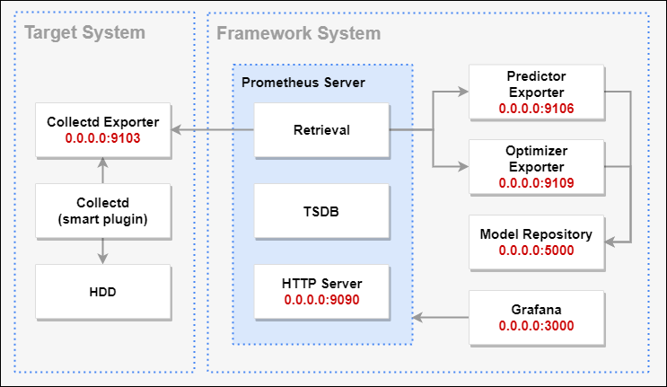
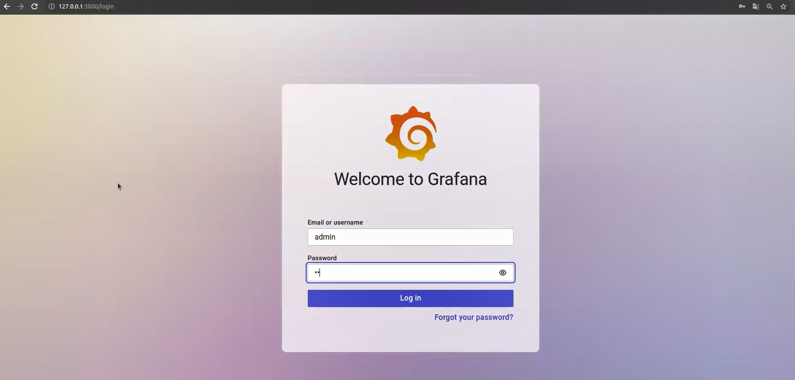
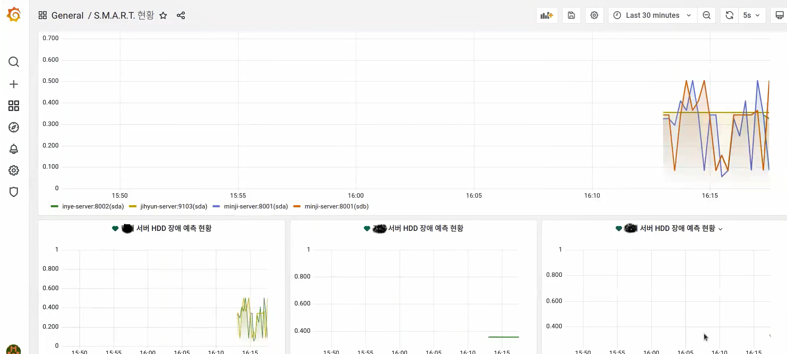

# ampm
## About
- S.M.A.R.T. 데이터를 이용한 하드 드라이브 장애 예측 시스템
- 장애 예측에 대한 최적의 모델을 생성하고 예측에 적용되는 과정을 자동화한 시스템

## Terminology
- S.M.A.R.T.
  - Self-Monitoring, Analysis and Reporting Technology
  - 하드 드라이브(HDD, SSD, eMMC)에 포함된 모니터링 시스템
  - 임박한 드라이브 장애(failure)를 탐지하고 알리는 것이 목적
- S.M.A.R.T. 데이터
  - S.M.A.R.T.에서 수집한 데이터
  - 하드 드라이브의 상태를 약 70개의 속성으로 표시
  - normalized 값은 1-253 사이의 정규화된 값이며 good or bad 상태인지 판단 가능 (default 100)
  - S.M.A.R.T. 속성은 제조사마다 의미와 해석이 다양하지만 몇 가지 속성은 같은 의미를 내포하고 있어 호환이 가능

## Architecture


## Modules
| 이름               | 역할                                    | 포트 | 외부 노출  |
|--------------------|--------------------------------------- | ------- | --------- |
|collectd-installer  |collectd 설치                            |         |N         |
|collectd-exporter	 |collectd 데이터 exporter          	      |9103     |Y         |  
|model-repository	   |모델 학습 결과 데이터 및 estimators 저장소 |5000/21  |Y         |
|smart-optimizer	   |모델 학습	                               |9109	    |Y         |
|smart-predictor	   |장애 예측 및 예측 결과 exporter	         |9106	    |Y         |
|prometheus	         |Metric 데이터 저장 및 관리                |9090	     |Y         |
|grafana	           |prometheus 데이터 시각화                  |3000      |Y         |

## Modeling
- Estimators : Random Forest, XGBoost, One-Class SVM
- 트레이닝 데이터
  - Backblaze 데이터 센터 2021년 4월~6월 s.m.a.r.t 데이터
  - 장애 및 비장애 데이터 비율 5:5
- 테스트 데이터
  - Collectd 수집 컬럼 형태에 맞춰 장애 데이터 삽입
  - 장애 데이터 선정 기준은 Backblaze s.m.a.r.t 주요 속성 활용
- 데이터 전처리 
  - MinMaxScaler : 데이터 값들의 범위가 넓어 인코딩하여 사용
- 하이퍼 파라미터 튜닝
  - GridSearchCV 사용하여 하이퍼파라미터를 튜닝하는 과정을 자동화

## Prerequisites
- SELinux 비활성화
  ```bash
  # 메모리에 저장된 SELinux 설정 변경
  $ sudo setenforce 0
  # 재부팅 시에도 적용되도록 영구적인 설정 변경
  $ sudo vi /etc/selinux/config
	SELINUX=disabled
  ```
- ssh, firewalld 설치 확인
  ```bash
  $ sudo systemctl status sshd
  $ sudo systemctl status firewalld
  ```
- Docker 설치
  ```bash
  # yum-utils 설치
  $ sudo yum install -y yum-utils
  # yum repolist에 docker용 추가
  $ sudo yum-config-manager \
      --add-repo \
      https://download.docker.com/linux/centos/docker-ce.repo
  # docker-ce, docker-ce-cli, containerd.io 설치
  $ sudo yum -y install docker-ce docker-ce-cli containerd.io
  # 버전 확인
  $ sudo docker --version
  # systemctl로 docker 서비스 시작
  $ sudo systemctl start docker
  ```
- Docker-compose 설치
  ```
  # github에서 os와 arch에 맞는 docker-compose 파일을 받아서 /usr/local/bin/docker-compose에 저장
  $ sudo curl -L "https://github.com/docker/compose/releases/download/1.29.2/docker-compose-$(uname -s)-$(uname -m)" -o /usr/local/bin/docker-compose
  # 내려받은 파일에 실행권한 추가
  $ sudo chmod +x /usr/local/bin/docker-compose
  # sudo 명령어 사용을 위해 /usr/bin 디렉토리에 docker-compose 링크 생성
  $ sudo ln -s /usr/local/bin/docker-compose /usr/bin/docker-compose
  # version 확인 명령어로 잘 설치되었는지 확인
  $ docker-compose --version
  ```
- Git 설치
  ```bash
  $ sudo yum -y install git
  ```
## Installation
```bash
$ sudo git clone https://github.com/multicampus-AMPM/ampm.git
$ cd ampm
$ docker-compose up -d --build
```
💡 가상 머신에서는 S.M.A.R.T. 데이터가 수집되지 않으므로 가상 머신에서 테스트할 경우 docker-compose.yml에서 jihyun-exporter 서비스를 주석 처리하고 jihyun-alt-exporter 서비스를 주석 제거한다.

## Grafana 실행
- http://서버IP:3000으로 접속하여 admin/admin 로그인
  
- 대시보드로 이동
  
